# Open Source Models with Hugging Face

**🤗 Hugging Face Overview:**
Hugging Face is a leading platform for natural language processing (NLP), offering a vast repository of pre-trained models, datasets, and tools, empowering developers and researchers to build innovative NLP applications with ease.


### 😸 Jupyter Notebook Shortcuts
```
https://towardsdatascience.com/jypyter-notebook-shortcuts-bf0101a98330
```

### 🐍 Python Environment Setup
- Install vscode

- Install Python pyenv

- Install python 3.10.8 using pyenv (Pyevn cheat sheet added below)

- video link to install pyenv and python
```sh
    https://www.youtube.com/watch?v=HTx18uyyHw8
```
```sh
    https://k0nze.dev/posts/install-pyenv-venv-vscode/
```
ref link: https://github.com/Shibli-Nomani/MLOps-Project-AirTicketPricePrediction

##### Activate Python Env in VSCODE

```sh
   pyenv shell 3.10.8
```
##### Create Virtual Env

- #create directory if requires
```sh
mkdir nameoftheproject
```
- #install virtualenv
```sh
pip install virtualenv
```
- #create virtualenv uder the project directory
```sh
python -m venv hugging_env
```
- #activate virtual env in powershell
```sh
   .\hugging_env\Scripts\activate
```
- #install dependancy(python libraries)
```sh
pip install -r requirements.txt 
```
### 💁 Hugging Face Hub and Model Selection Process

 '''
     https://huggingface.co/
 '''
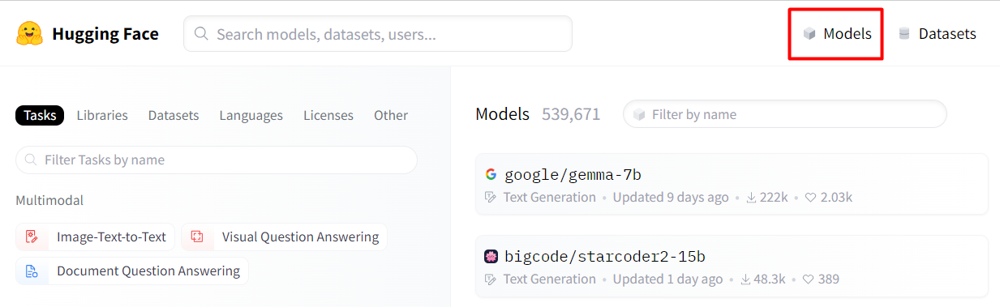

##### Model Memory Requirement

**ref link:** https://huggingface.co/openai/whisper-large-v3/tree/main


- #model weight
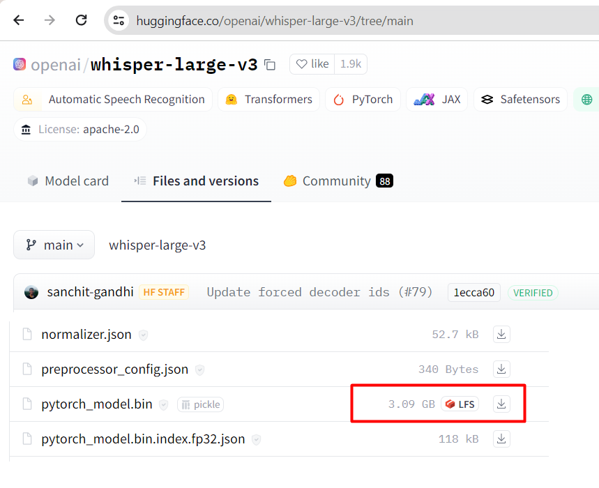


**`Memory Requirement: trained model weights * 1.2 
here, 3.09 - model weight = (3.09GB*1.2) = 3.708GB memory requires in your local pc.`**

##### Task Perform with Hugging Face


For Automatic Speech Recognation

>> Hugging Face >> Tasks >> Scroll Down >> Choose your task >> Automatic Speech Recognation >> openai
/whisper-large-v3 `[best recommendation as per Hugging Face]`

- **Pipeline code snippets to perform complex preprocessing of data and model integration.**

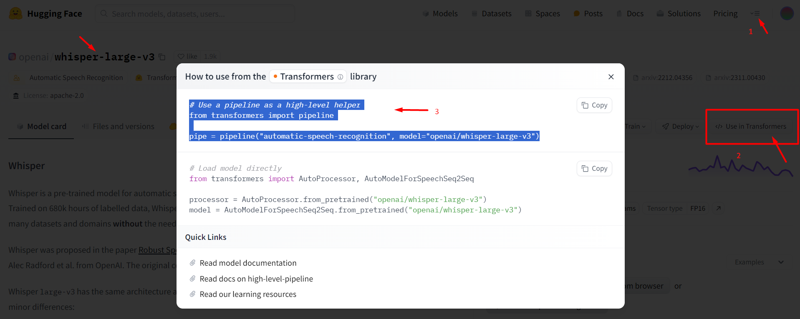

### 🔤 Defination of NLP

NLP 🧠💬 (Natural Language Processing) is like teaching computers to understand human language 🤖📝. It helps them read, comprehend, extract 📑🔍, translate 🌐🔤, and even generate text 📚🔍.

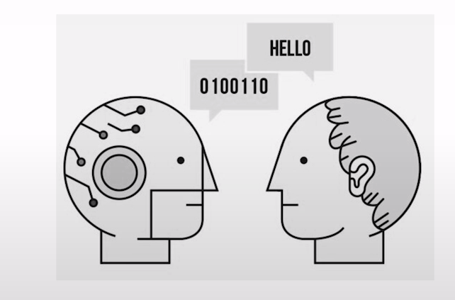

### 🤖 Transformers 
A Transformer 🤖🔄 is a deep learning model designed for sequential tasks, like language processing. It's used in NLP 🧠💬 for its ability to handle long-range dependencies and capture context effectively, making it crucial for tasks such as machine translation 🌐🔤, text summarization 📝🔍, and sentiment analysis 😊🔍. It's considered state-of-the-art due to its efficiency in training large-scale models and achieving impressive performance across various language tasks. 🚀📈

### 🔥 PyTorch
PyTorch is an open-source machine learning framework developed by Facebook's AI Research lab (FAIR), featuring dynamic computational graphs and extensive deep learning support, empowering flexible and efficient model development.

### 🤗 Task-01: Chatbot
github link: 
kaggle link: 

##### 🌐 Libraries Installation

`! pip install transformers`

- 👉 model-1(blenderbot-400M-distill): https://huggingface.co/facebook/blenderbot-400M-distill/tree/main

🤖 The "blenderbot-400M-distill" model, detailed in the paper "Recipes for Building an Open-Domain Chatbot," enhances chatbot performance by emphasizing conversational skills like engagement and empathy. Through large-scale models and appropriate training data, it outperforms existing approaches in multi-turn dialogue, with code and models available for public use.

### ✨ Find Appropiate LLM Model For Specific Task
- 👉 LLM Leadears Board: https://huggingface.co/spaces/HuggingFaceH4/open_llm_leaderboard
- 👉 chatbot-arena-leaderboard: https://huggingface.co/spaces/lmsys/chatbot-arena-leaderboard


### 🤗 Task-02: Text Translation and Summarization

#### 🎭 Text Translation
🌐 Text Translation: Converting text from one language to another, facilitating cross-cultural communication and understanding.

##### 🌐 Libraries Installation

`! pip install transformers`
`! pip install torch`

- 👉 model-2(nllb-200-distilled-600M): https://huggingface.co/facebook/nllb-200-distilled-600M/tree/main

🌐 NLLB-200(No Language Left Behind), the distilled 600M variant, excels in machine translation research, offering single-sentence translations across 200 languages. Detailed in the accompanying paper, it's evaluated using BLEU, spBLEU, and chrF++ metrics, and trained on diverse multilingual data sources with ethical considerations in mind. While primarily for research, its application extends to improving access and education in low-resource language communities. Users should assess domain compatibility and acknowledge limitations regarding input lengths and certification.

- 👉 Language code for machine translation: https://github.com/facebookresearch/flores/blob/main/flores200/README.md#languages-in-flores-200

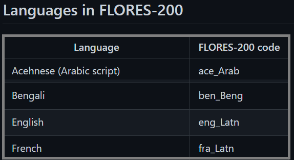

```
### 🚩 To Clear Memory Allocation

Delete model and clear memory using **Garbage Collector**.

#garbage collector
import gc
#del model
del translator
#reclaiming memory occupied by objects that are no longer in use by the program
gc.collect()

```
#### ⛽ Text Summarization
📑 Text Summarization: Condensing a piece of text while retaining its essential meaning, enabling efficient information retrieval and comprehension.

##### 🌐 Libraries Installation

`! pip install transformers`
`! pip install torch`

- 👉 model-3(bart-large-cnn): https://huggingface.co/facebook/bart-large-cnn/tree/main


🤖 BART (large-sized model), fine-tuned on CNN Daily Mail, excels in text summarization tasks. It employs a transformer architecture with a bidirectional encoder and an autoregressive decoder, initially introduced in the paper "BART: Denoising Sequence-to-Sequence Pre-training for Natural Language Generation, Translation, and Comprehension" by Lewis et al. This model variant, although lacking a specific model card from the original team, is particularly effective for generating summaries, demonstrated by its fine-tuning on CNN Daily Mail text-summary pairs.

### 🤗 Task-03: Sentence Embedding


- 🔍 Sentence Embedding Overview:
Sentence embedding represents a sentence as a dense vector in a high-dimensional space, capturing its semantic meaning.

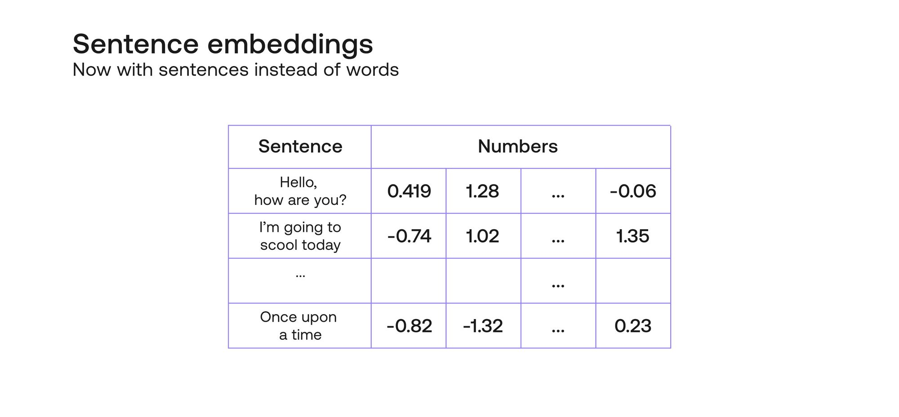

- 🔧 Encoder Function:
During embedding, the encoder transforms the sentence into a fixed-length numerical representation by encoding its semantic information into a vector format.

- 📏 Cosine Similarity/Distance:
Cosine similarity measures the cosine of the angle between two vectors, indicating their similarity in orientation. It's vital for comparing the semantic similarity between sentences, irrespective of their magnitude.

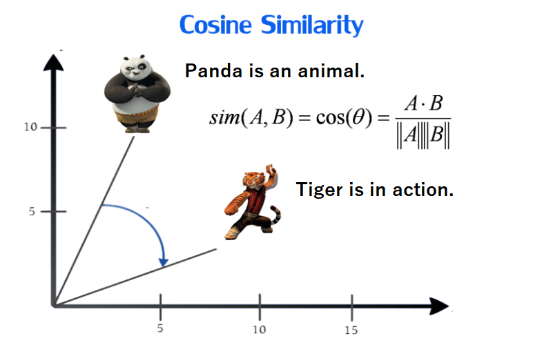


- 🎯 Importance of Cosine Similarity/Distance:
Cosine similarity is crucial for tasks like information retrieval, document clustering, and recommendation systems, facilitating accurate assessment of semantic similarity while ignoring differences in magnitude.

##### 🌐 Libraries Installation

`! pip install transformers`
`! pip install sentence-transformers`

- 👉 model-3(all-MiniLM-L6-v2): https://huggingface.co/sentence-transformers/all-MiniLM-L6-v2/tree/main

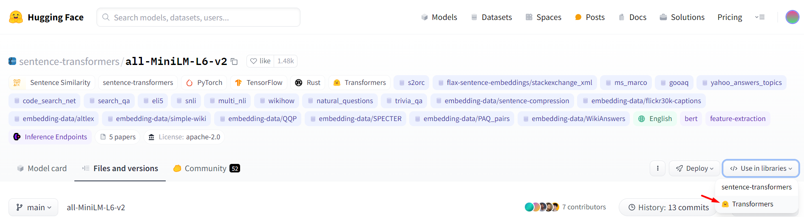

🔍 All-MiniLM-L6-v2 Overview:
The All-MiniLM-L6-v2 sentence-transformers model efficiently maps sentences and paragraphs into a 384-dimensional dense vector space, facilitating tasks such as clustering or semantic search with ease.

### 🤗 Task-04: Audio Classification

**📛Zero-Shot:**

"Zero-shot" refers to the fact that the model makes predictions without direct training on specific classes. Instead, it utilizes its understanding of general patterns learned during training on diverse data to classify samples it hasn't seen before. Thus, "zero-shot" signifies that the model doesn't require any training data for the specific classes it predicts.

- **🤖 transformers:** This library provides access to cutting-edge pre-trained models for natural language processing (NLP), enabling tasks like **`text classification, language generation, and sentiment analysis`** with ease. It streamlines model implementation and fine-tuning, fostering rapid development of NLP applications.

- **📊 datasets:** Developed by Hugging Face, this library offers a **`comprehensive collection of datasets`** for NLP tasks, simplifying data acquisition, preprocessing, and evaluation. It enhances reproducibility and facilitates experimentation by providing access to diverse datasets in various languages and domains.

- **🔊 soundfile:** With functionalities for reading and writing audio files in Python, this library enables seamless audio processing for tasks such as **`speech recognition, sound classification, and acoustic modeling`**. It empowers users to handle audio data efficiently, facilitating feature extraction and analysis.

- **🎵 librosa:** Specializing in **`music and sound analysis`**, this library provides tools for audio feature extraction, spectrogram computation, and pitch estimation. It is widely used in applications like **`music information retrieval, sound classification, and audio-based machine learning tasks`**, offering essential functionalities for audio processing projects.

#### 🔊 Ashraq/ESC50 Dataset Overview:
The Ashraq/ESC50 dataset is a collection of 2000 environmental sound recordings, categorized into 50 classes, designed for sound classification tasks. Each audio clip is 5 seconds long and represents various real-world environmental sounds, including animal vocalizations, natural phenomena, and human activities.

##### 🌐 Libraries Installation

`! pip install transformers`
`!pip install datasets`
`!pip install soundfile`
`!pip install librosa`

- 👉 model-4(clap-htsat-unfused ): https://huggingface.co/laion/clap-htsat-unfused/tree/main

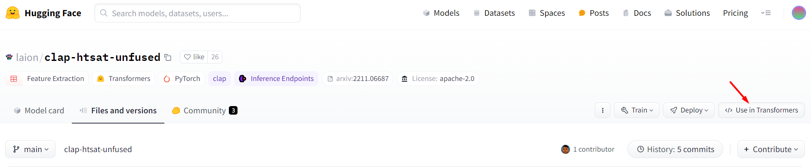

🛠️ clap-htsat-unfused  offers a pipeline for contrastive language-audio pretraining, leveraging large-scale audio-text pairs from LAION-Audio-630K dataset.
The model incorporates feature fusion mechanisms and keyword-to-caption augmentation, enabling processing of variable-length audio inputs.
Evaluation across text-to-audio retrieval and audio classification tasks showcases its superior performance and availability for public use.


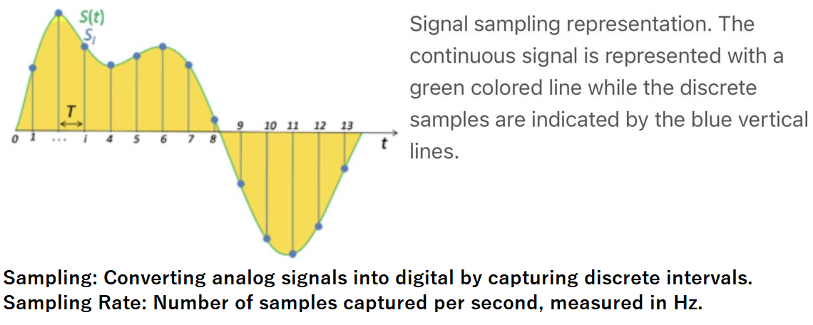


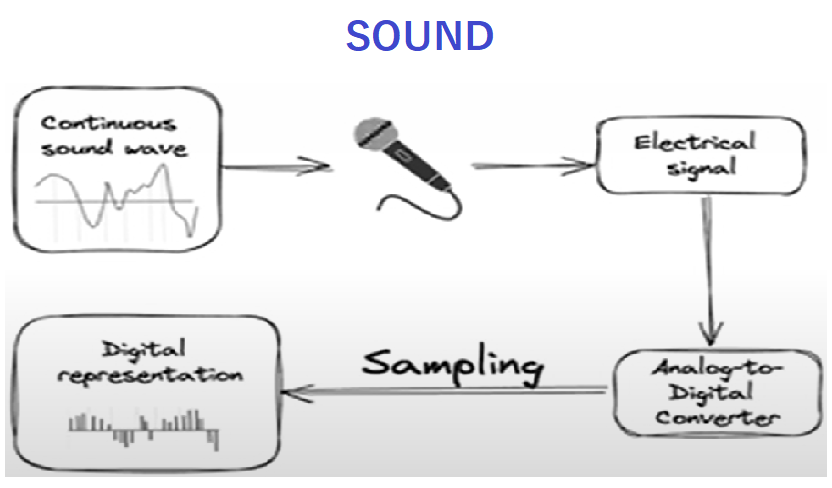

##### 👤 Human Speech Recording: 16,000 Hz
##### 📡 Walkie Talkie/Telephone: 8,000 Hz
##### 🔊 High Resolution Audio: 192,000 Hz

### 📌 key note for Audio Signal Processing:

For 5 sec of video, **SIGNAL VALUE** is (5 x 8000) = 40,000

In case of transformers, the **SIGNAL VALUE** relies on 🔆 Sequences and 🔆 Attention Mechanism..
**SIGNAL VALUE** will look like 60 secs for 1 secs.

In the case of transformers, particularly in natural language processing tasks, the **SIGNAL VALUE** is determined by the length of the 🔆input sequences and the 🔆 attention mechanism employed. Unlike traditional video processing, where each frame corresponds to a fixed time interval, in transformers, the **SIGNAL VALUE** may appear to be elongated due to the attention mechanism considering sequences of tokens. For example, if the attention mechanism processes 60 tokens per second, the **SIGNAL VALUE** for 1 second of input may appear equivalent to 60 seconds in terms of processing complexity.


In natural language processing, the **input sequence** refers to a series of tokens representing words or characters in a text. The **attention mechanism in transformers** helps the model focus on relevant parts of the input sequence during processing by **assigning weights to each token**, allowing the model to **prioritize important information**. Think of it like giving more attention to key words in a sentence while understanding its context, aiding in tasks like translation and summarization.

### 🤗 Task-05: Automatic Speech Recognation(ASR)

##### 🌐 Libraries Installation

`! pip install transformers`
`!pip install datasets`
`!pip install soundfile`
`!pip install librosa`
`!pip install gradio`

- !pip install transformers: Access state-of-the-art natural language processing models and tools. 🤖
- !pip install datasets: Simplify data acquisition and preprocessing for natural language processing tasks. 📊
- !pip install soundfile: Handle audio data reading and writing tasks efficiently. 🔊
- !pip install librosa: Perform advanced audio processing and analysis tasks. 🎵
- !pip install gradio: Develop interactive web-based user interfaces for machine learning models. 🌐

**Librosa** is a Python library designed for audio and music signal processing. It provides functionalities for tasks such as audio loading, feature extraction, spectrogram computation, pitch estimation, and more. Librosa is commonly used in applications such as music information retrieval, sound classification, speech recognition, and audio-based machine learning tasks.

🎙️ LibriSpeech ASR: A widely-used dataset for automatic speech recognition (ASR), containing a large collection of English speech recordings derived from audiobooks. With over 1,000 hours of labeled speech data, it facilitates training and evaluation of ASR models for transcription tasks.

👉 dataset: https://huggingface.co/datasets/librispeech_asr

👉 model: https://huggingface.co/distil-whisper

👉 model: https://github.com/huggingface/distil-whisper

**🔍 Distil-Whisper:**

Distil-Whisper, a distilled variant of Whisper, boasts 6 times faster speed, 49% smaller size, and maintains a word error rate (WER) within 1% on out-of-distribution evaluation sets. With options ranging from distil-small.en to distil-large-v2, it caters to diverse latency and resource constraints. 📈🔉

  - Virtual Assistants
  - Voice-Controlled Devices
  - Dictation Software
  - Mobile Devices
  - Edge Computing Platforms
  - Online Transcription Services

### ✨ Gradio: 

🛠️🚀 Build & Share Delightful Machine Learning Apps

Gradio offers the fastest way to showcase your machine learning model, providing a user-friendly web interface that enables anyone to utilize it from any location!

**👉 Gradio Website:** https://www.gradio.app/

**👉 Gradio In Hugging Face:** https://huggingface.co/gradio

**👉 Gradio Github:** https://github.com/gradio-app/gradio


**🌐🛠️ Gradio: Develop Machine Learning Web Apps with Ease**

Gradio, an open-source Python package, enables swift creation of demos or web apps for your ML models, APIs, or any Python function. Share your creations instantly using built-in sharing features, requiring no JavaScript, CSS, or web hosting expertise.

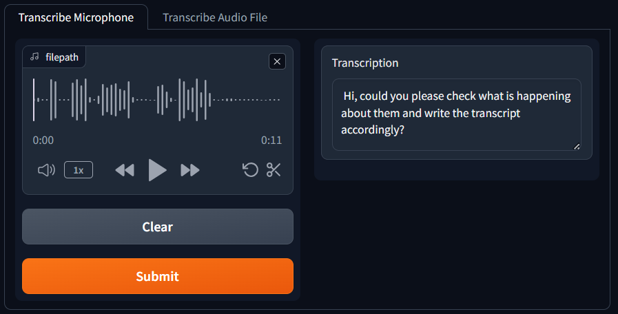

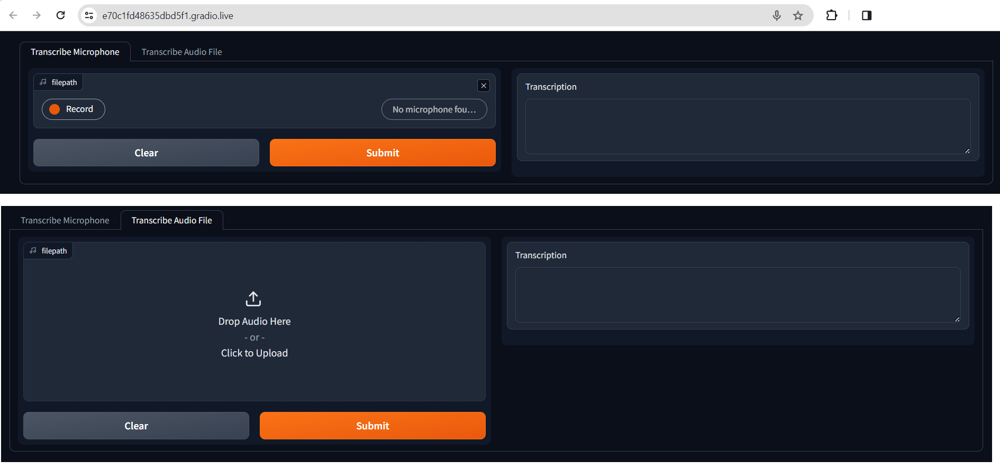

**📌 error:** DuplicateBlockError: At least one block in this Blocks has already been rendered.

**💉 solution:** change the `block name` that we have declared earlier.

**`demonstrations = gr.Blocks()`**

- **🚦 note:** The app will continue running unless you run **demo.close()**

### Text to Speech

#### Libraries Installation

`!pip install transformers`
`!pip install gradio`
`!pip install timm`
`!pip install timm`
`!pip install inflect`
`!pip install phonemizer`

- **!pip install transformers:** Installs the Transformers library, which provides state-of-the-art natural language processing models for various tasks such as text classification, translation, summarization, and question answering.

- **!pip install gradio:** Installs Gradio, a Python library that simplifies the creation of interactive web-based user interfaces for machine learning models, allowing users to interact with models via a web browser.

- **!pip install timm:** Installs Timm, a PyTorch library that offers a collection of pre-trained models and a simple interface to use them, primarily focused on computer vision tasks such as image classification and object detection.

- **!pip install inflect:** Installs Inflect, a Python library used for converting numbers to words, pluralizing and singularizing nouns, and generating ordinals and cardinals.

- **!pip install phonemizer:** Installs Phonemizer, a Python library for converting text into phonetic transcriptions, useful for tasks such as text-to-speech synthesis and linguistic analysis.

**📌Note:** py-espeak-ng is only available Linux operating systems.

To run locally in a Linux machine, follow these commands:

```sh
  sudo apt-get update
```
```sh
  sudo apt-get install espeak-ng
```
```sh
  pip install py-espeak-ng
```
**📕 APT stands for Advanced Package Tool**. It is a package management system used by various Linux distributions, including Debian and Ubuntu. APT allows users to install, update, and remove software packages on their system from repositories. It also resolves dependencies automatically, ensuring that all required dependencies for a package are installed.


- sudo apt-get update: Updates the package index of APT.
- sudo apt-get install espeak-ng: Installs the espeak-ng text-to-speech synthesizer.
- pip install py-espeak-ng: Installs the Python interface for espeak-ng.

👉 model: https://github.com/huggingface/distil-whisper


**🔍 kakao-enterprise/vits-ljs:**

🔊📚 VITS: Conditional Variational Autoencoder with Adversarial Learning for End-to-End Text-to-Speech

- Overview:

VITS is an end-to-end model for speech synthesis, utilizing a conditional variational autoencoder (VAE) architecture. It predicts speech waveforms based on input text sequences, incorporating a flow-based module and a stochastic duration predictor to handle variations in speech rhythm.

- Features:

🔹 The model generates spectrogram-based acoustic features using a Transformer-based text encoder and coupling layers, allowing it to capture complex linguistic patterns.

🔹 It includes a stochastic duration predictor, enabling it to synthesize speech with diverse rhythms from the same input text.

- Training and Inference:

🔹 VITS is trained with a combination of variational lower bound and adversarial training losses.

🔹 Normalizing flows are applied to enhance model expressiveness.

🔹 During inference, text encodings are up-sampled based on duration predictions and mapped into waveforms using a flow module and HiFi-GAN decoder.

- Variants and Datasets:

🔹 Two variants of VITS are trained on LJ Speech and VCTK datasets.

🔹 LJ Speech comprises 13,100 short audio clips (approx. 24 hours), while VCTK includes approximately 44,000 short audio clips from 109 native English speakers (approx. 44 hours).


👉 model: https://huggingface.co/kakao-enterprise/vits-ljs

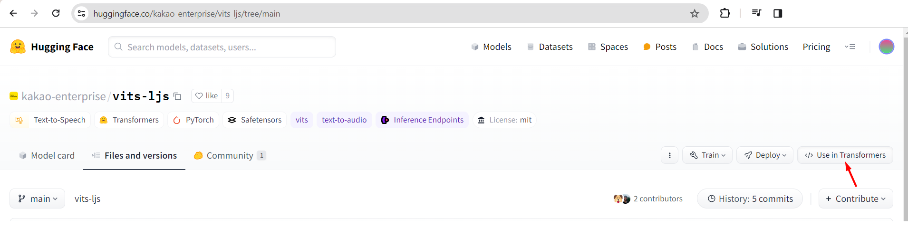

### 📝🔊 Text to Audio Wave


Text-to-audio waveform array for speech generation is the process of converting **textual input** into a **digital audio waveform** representation. This involves `synthesizing speech from text`, where a machine learning model translates written words into spoken language. The model analyzes the text, generates corresponding speech signals, and outputs an audio waveform array that can be played back as human-like speech. The benefits include enabling natural language processing applications such as virtual assistants, audiobook narration, and automated customer service, enhancing accessibility for visually impaired individuals, and facilitating audio content creation in various industries.